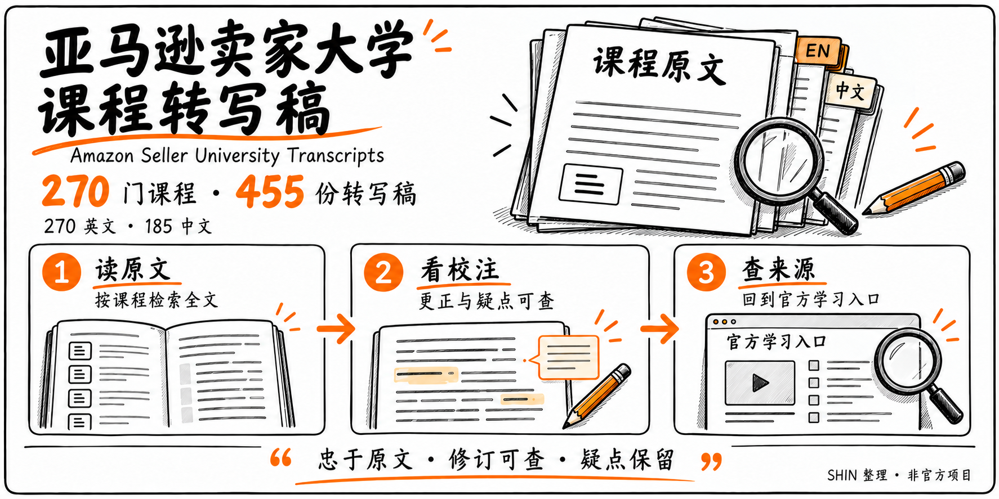
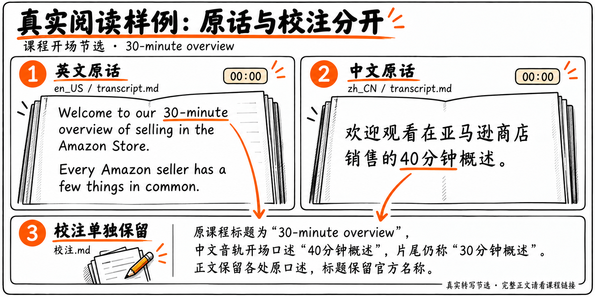
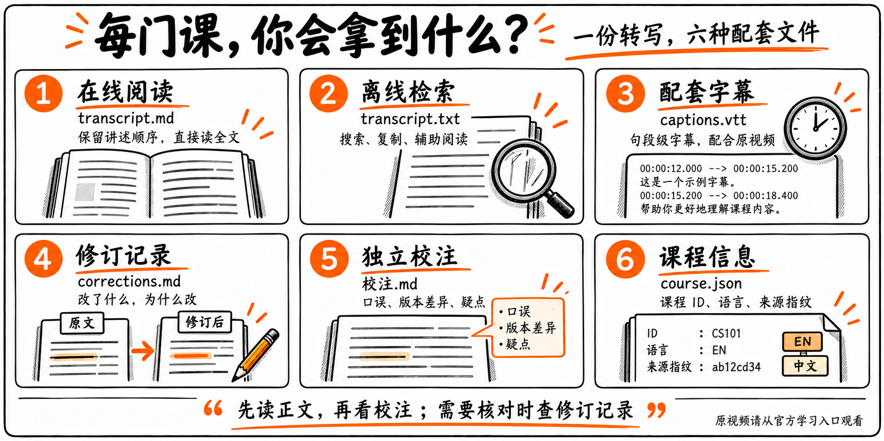

# Amazon Seller University Transcripts

**Full course text you can read, search, and check against its source.**



[Browse 270 courses](课程目录.md) · [Download](https://github.com/haloshin/amazon-seller-university-transcripts/releases/latest) · [简体中文](README.md)

An independent collection of calibrated transcripts from an archived selection of Amazon Seller University videos: **270 English transcripts and 185 Simplified Chinese transcripts**, with WebVTT captions, correction records, and separate editorial notes.

Read directly on GitHub or download the ZIP for offline search. No application or installation is required. The course index retains the original English course titles.

## Start reading

Open the [course catalog](课程目录.md), choose a language, and read `transcript.md`. See [Intro to Fulfillment by Amazon](courses/472d8e74-3402-4871-88d2-0ebaeb3263eb/en_US/transcript.md) for a complete example.

### A real transcript and its editorial note

The English opening says “30-minute,” while the Chinese audio says “40分钟” (40 minutes). Both transcripts preserve the original wording; the discrepancy is explained in a separate note.



[English transcript](courses/43b1701d-6ab4-4eea-829f-fa1f3affc63c/en_US/transcript.md) · [Chinese transcript](courses/43b1701d-6ab4-4eea-829f-fa1f3affc63c/zh_CN/transcript.md) · [Editorial note](courses/43b1701d-6ab4-4eea-829f-fa1f3affc63c/zh_CN/校注.md)

### Download and search

For offline use, download a [release](https://github.com/haloshin/amazon-seller-university-transcripts/releases/latest) or clone:

```bash
git clone https://github.com/haloshin/amazon-seller-university-transcripts.git
```

Each course includes Markdown, plain text, VTT captions, correction records, editorial notes, and JSON metadata. `catalog.json` provides a machine-readable index. If you use an AI reading assistant, include both the transcript and its editorial notes and ask it to distinguish source statements from inference.



The diagram illustrates file purposes; its subtitle and ID values are examples. Refer to course files for actual content.

## Scope and quality

The source archive was captured on **2026-07-27**; this calibration is dated **2026-10-07**. Chinese transcripts follow Chinese audio. They are not machine translations of the English transcripts. Eighty-five courses have no usable Chinese audio transcript in this archive.

All 458 archived videos underwent a second recognition pass and AI full-text review. Reviewers assessed 3,723 difference groups and applied 1,222 changes across the internal corpus. Three mislabeled or mismatched source files were isolated; the 455 normal transcripts form this release.

Twenty-nine transcripts contain course-specific editorial notes, and [two uncertain phrases](docs/KNOWN_ISSUES.md) remain explicitly marked. Caption text matches the corresponding TXT after whitespace normalization, with monotonic timing inside the video duration. Timing is machine-aligned at sentence/segment level. This is not a claim of word-by-word human listening or error-free transcription.

Original order, examples, numbers, and historical statements are preserved. Source mistakes and language-version differences are discussed separately. Check current official guidance before relying on historical course statements for business decisions.

[Method](校准说明.md) · [Source exceptions](源素材异常.md) · [Official learning portal](https://sell.amazon.com/learn/seller-university)

## Corrections

Please open an [issue](https://github.com/haloshin/amazon-seller-university-transcripts/issues/new?template=correction.yml) with the course, language, timestamp, current wording, proposed correction, and supporting evidence. See [CONTRIBUTING.md](CONTRIBUTING.md).

## Rights and attribution

Amazon Seller University course content and related marks belong to Amazon or their respective rights holders. This is an independent project maintained by [SHIN](https://github.com/haloshin); it is not an official Amazon publication or endorsement.

Public access does not create a new open-content license for the courses. The transcripts, captions, and underlying course content are **not relicensed under MIT or Creative Commons**. MIT applies only to the original validation scripts written for this repository. See [LICENSE](LICENSE) and [NOTICE.md](NOTICE.md).
