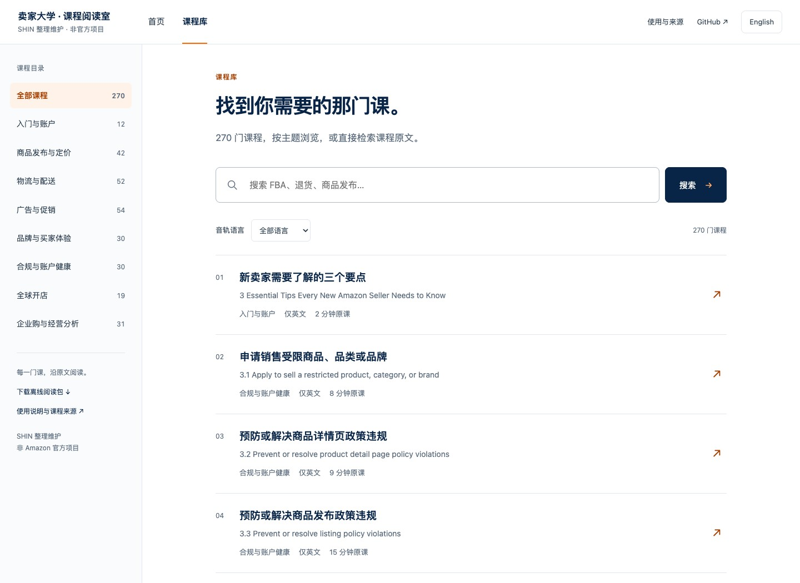
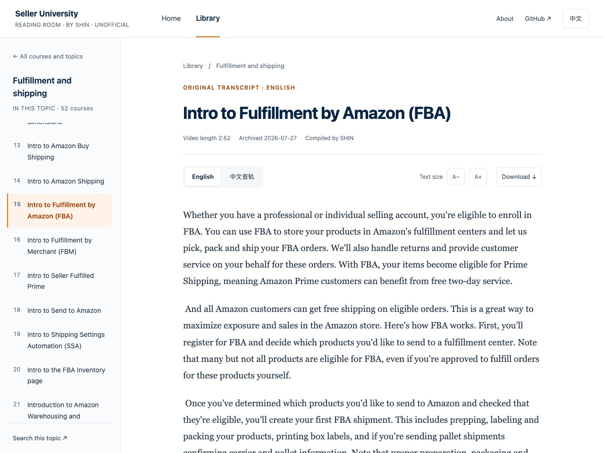
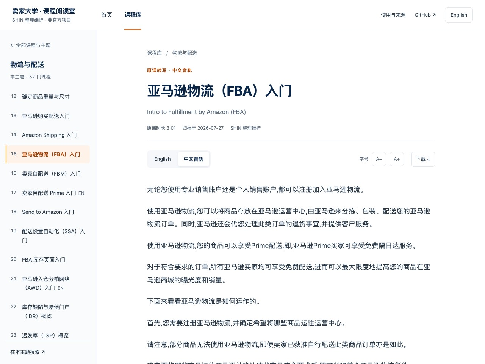

<a name="amazon-seller-university-transcripts"></a>

<h1 align="center">Amazon Seller University</h1>

<p align="center"><strong>Course transcripts · Read, search and learn offline</strong></p>

<p align="center">Keep the original course sequence and examples within easy reach.</p>

<p align="center">
  <a href="https://haloshin.github.io/amazon-seller-university-transcripts/#ui=en"><strong>Read online ↗</strong></a> &emsp;
  <a href="https://github.com/haloshin/amazon-seller-university-transcripts/releases/latest"><strong>Download ↓</strong></a> &emsp;
  <a href="#planned-updates"><strong>Follow updates →</strong></a>
</p>

<p align="center"><sub><a href="https://haloshin.github.io/amazon-seller-university-transcripts/#view=library&ui=en">All courses</a> &nbsp; · &nbsp; <a href="LEARNING_GUIDE.md">Markdown guide</a> &nbsp; · &nbsp; <a href="README.md">简体中文</a></sub></p>

<br>

<p align="center"></p>

<p align="center"><strong>270 courses &nbsp; / &nbsp; 455 transcripts &nbsp; / &nbsp; 8 topics</strong><br><sub>270 English · 185 Chinese-audio transcripts</sub></p>

<p align="center"><sub>Maintained by <a href="https://github.com/haloshin">SHIN</a> · Please retain source and credit · <a href="NOTICE.md">Terms of use</a></sub></p>

<br><br>

## Read online or offline

**[Open the HTML reader ↗](https://haloshin.github.io/amazon-seller-university-transcripts/#ui=en)** · [Markdown guide](LEARNING_GUIDE.md)

Browse all **270 courses and 455 transcripts** with full-text search, a contextual course directory, available audio-language switching and adjustable text size. Start with search or the guided reading path on the home page. Browse and filter in the dedicated library, then focus on the original text in the reader. Desktop and narrow screens are supported.

Download and extract the complete ZIP, then open **`index.html`** in a browser to read offline. Keep the entire folder together; no installation or local server is needed.

[](https://haloshin.github.io/amazon-seller-university-transcripts/#ui=en)

<sub>Start on the home page → Choose a course in the library → Read the original transcript. Full-text search also works offline.</sub>

<br><br>

## Browse by topic

[](https://haloshin.github.io/amazon-seller-university-transcripts/#view=library&ui=en)

Start with the question you are working on.

<br>

| Launch and operate | Grow and manage |
| :--- | :--- |
| [Getting started and accounts · 12](https://haloshin.github.io/amazon-seller-university-transcripts/#topic=start&ui=en) | [Advertising and promotions · 54](https://haloshin.github.io/amazon-seller-university-transcripts/#topic=ads&ui=en) |
| [Listings and pricing · 42](https://haloshin.github.io/amazon-seller-university-transcripts/#topic=listings&ui=en) | [Brands and customer experience · 30](https://haloshin.github.io/amazon-seller-university-transcripts/#topic=brands&ui=en) |
| [Fulfillment and shipping · 52](https://haloshin.github.io/amazon-seller-university-transcripts/#topic=fulfillment&ui=en) | [Global selling · 19](https://haloshin.github.io/amazon-seller-university-transcripts/#topic=global&ui=en) |
| [Compliance and account health · 30](https://haloshin.github.io/amazon-seller-university-transcripts/#topic=compliance&ui=en) | [Amazon Business and business insights · 31](https://haloshin.github.io/amazon-seller-university-transcripts/#topic=business&ui=en) |

<sub>Topic groups and Chinese navigation names are editorial additions. Original titles are retained. Courses without a Chinese-audio transcript are available in English.</sub>

<br><br>

## Start here

<br>

1. **[5-minute overview for beginners](https://haloshin.github.io/amazon-seller-university-transcripts/#view=course&id=eaf6dccf-18fd-49ee-9b08-988472334a0b&lang=en_US&ui=en)** · [中文](https://haloshin.github.io/amazon-seller-university-transcripts/#view=course&id=eaf6dccf-18fd-49ee-9b08-988472334a0b&lang=zh_CN&ui=en)
2. **[Intro to Seller Central](https://haloshin.github.io/amazon-seller-university-transcripts/#view=course&id=7656f83f-df7c-4a3f-93e6-84c7a1358cf9&lang=en_US&ui=en)** · [中文](https://haloshin.github.io/amazon-seller-university-transcripts/#view=course&id=7656f83f-df7c-4a3f-93e6-84c7a1358cf9&lang=zh_CN&ui=en)
3. **[Overview of Amazon selling policies](https://haloshin.github.io/amazon-seller-university-transcripts/#view=course&id=84fea35b-c5c6-4ae3-999b-1cea1b3a6d96&lang=en_US&ui=en)** · [中文](https://haloshin.github.io/amazon-seller-university-transcripts/#view=course&id=84fea35b-c5c6-4ae3-999b-1cea1b3a6d96&lang=zh_CN&ui=en)
4. **[Intro to listing products](https://haloshin.github.io/amazon-seller-university-transcripts/#view=course&id=a33f0b1d-5508-4db1-bd53-e24a3d9fb9b3&lang=en_US&ui=en)** · [中文](https://haloshin.github.io/amazon-seller-university-transcripts/#view=course&id=a33f0b1d-5508-4db1-bd53-e24a3d9fb9b3&lang=zh_CN&ui=en)
5. **[Intro to Fulfillment by Amazon (FBA)](https://haloshin.github.io/amazon-seller-university-transcripts/#view=course&id=472d8e74-3402-4871-88d2-0ebaeb3263eb&lang=en_US&ui=en)** · [中文](https://haloshin.github.io/amazon-seller-university-transcripts/#view=course&id=472d8e74-3402-4871-88d2-0ebaeb3263eb&lang=zh_CN&ui=en)

<sub>Fulfilling orders yourself? Continue with <a href="https://haloshin.github.io/amazon-seller-university-transcripts/#view=course&amp;id=43f40d1f-0d52-4a7a-9c65-bb5be2ab5c01&amp;lang=en_US&amp;ui=en">Intro to Fulfillment by Merchant (FBM)</a>.</sub>

<br><br>

## Read a real excerpt

The English FBA introduction in the reader. Switch audio transcripts, adjust the text size or download a course from the toolbar. Each transcript follows its corresponding audio.

[](https://haloshin.github.io/amazon-seller-university-transcripts/#view=course&id=472d8e74-3402-4871-88d2-0ebaeb3263eb&lang=en_US&ui=en)

<details>
<summary>View the Chinese-audio reading page</summary>

[](https://haloshin.github.io/amazon-seller-university-transcripts/#view=course&id=472d8e74-3402-4871-88d2-0ebaeb3263eb&lang=zh_CN&ui=zh)

</details>

<br>

**[Read the English course ↗](https://haloshin.github.io/amazon-seller-university-transcripts/#view=course&id=472d8e74-3402-4871-88d2-0ebaeb3263eb&lang=en_US&ui=en)** &emsp; [中文全文](https://haloshin.github.io/amazon-seller-university-transcripts/#view=course&id=472d8e74-3402-4871-88d2-0ebaeb3263eb&lang=zh_CN&ui=en)

<br><br>

## Planned updates

<br>


<br>

**The Seller University Skill and course question bank are planned, not yet released.** Details and timing will be announced later. Neither is included in the current download.

**Star to bookmark · Watch for updates**<br>
Choose Watch → Custom → Releases for release notifications. [Published versions](https://github.com/haloshin/amazon-seller-university-transcripts/releases)

<br><br>

## Download and use

Read and search offline after downloading.

<br>

**[Download the complete ZIP ↓](https://github.com/haloshin/amazon-seller-university-transcripts/releases/latest)** &emsp; **[Read online ↗](https://haloshin.github.io/amazon-seller-university-transcripts/#ui=en)**

<br>

### Extract the ZIP, then open index.html

Open **`index.html`** in a browser to choose courses, search and read offline. You can also use `LEARNING_GUIDE.md`, a Markdown viewer or TXT files.

<br>


<br>

<details>
<summary><strong>File formats, captions and more ways to use the materials</strong></summary>

<br>

- **HTML** — `index.html`, the complete browser reader with all transcripts, topic navigation and full-text search. Reading works offline; external links need a network connection.
- **Markdown** — `transcript.md`, for reading in GitHub or a Markdown viewer.
- **TXT** — `transcript.txt`, for full-text search, copying or importing into a reading tool.
- **VTT** — `captions.vtt`, for a player that supports external captions alongside the original video. Videos are not included.

The ZIP includes [usage instructions](使用说明.txt), [LICENSE](LICENSE) and [NOTICE](NOTICE.md). TXT and VTT retain the course text; attribution and terms appear on the reading pages and in the accompanying notices.

You can also clone the repository:

```bash
git clone https://github.com/haloshin/amazon-seller-university-transcripts.git
```

For AI-assisted study, provide the selected transcript and any accompanying reading notes. Ask the assistant to cite the text and distinguish course statements from its own explanation.

</details>

<br>

### Continue within the topic

<br>

**[Try the FBA course ↗](https://haloshin.github.io/amazon-seller-university-transcripts/#view=course&id=472d8e74-3402-4871-88d2-0ebaeb3263eb&lang=en_US&ui=en)**

<sub>Chinese pages label a next course as English when no Chinese-audio transcript is available. Language links reflect the available audio tracks.</sub>

<br><br>

## Sources and feedback

### Keep the source and the editor's credit

Independently maintained by **[SHIN](https://github.com/haloshin)**, without official Amazon endorsement. Please retain the course source, editorial credit and [original repository link](https://github.com/haloshin/amazon-seller-university-transcripts). Do not claim SHIN's contribution as your own or imply an official publication.

Course content and related marks belong to their respective rights holders. Redistribution or commercial use beyond the limited permission for copyrightable original editorial material owned by SHIN requires separate permission. Normal forks, statutory exceptions and the scripts' MIT license remain unaffected. [Full terms](NOTICE.md) · [LICENSE](LICENSE)

<br>

- **Watch the original video** — visit the [official Amazon Seller University portal](https://sell.amazon.com/learn/seller-university) and search by the original title. Some content requires Seller Central sign-in.
- **Report a correction** — [submit feedback](https://github.com/haloshin/amazon-seller-university-transcripts/issues/new?template=correction.yml) with the course, language, timestamp and supporting evidence.

<sub>Scope: courses archived on 2026-07-27. Chinese transcripts follow Chinese audio. A small number of courses include brief reading notes. Check current official fees, policies and interfaces. <a href="docs/SOURCES.md">Sources</a> · <a href="CONTRIBUTING.md">Contributing</a></sub>

<br>
