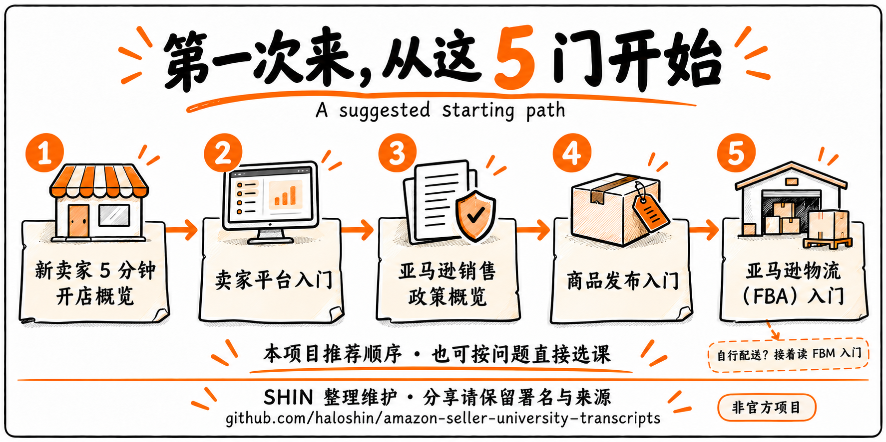
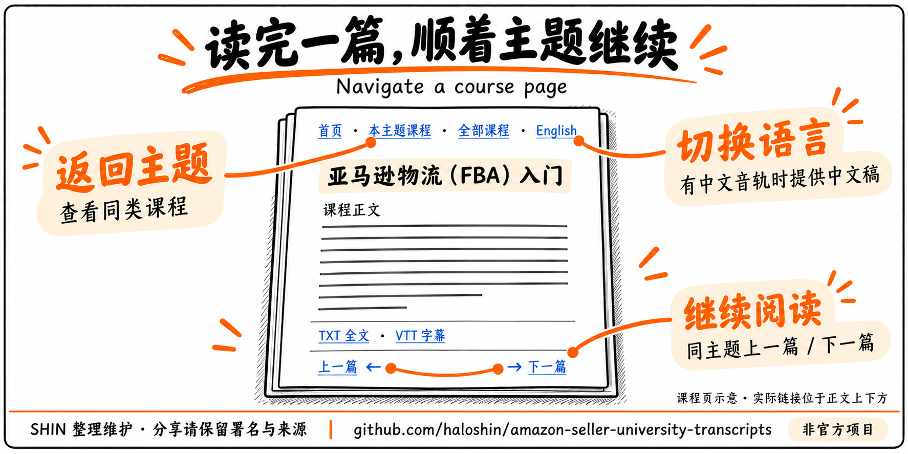
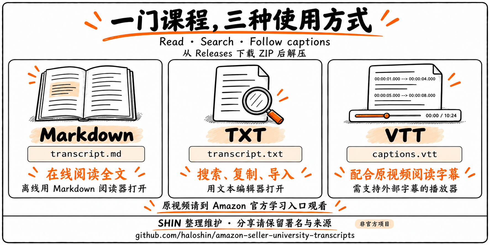

# 亚马逊卖家大学 · 课程转写稿

**270 门课程，随时阅读与检索。**

[SHIN](https://github.com/haloshin) 整理维护 · 免费公开学习资料 · [署名与使用](NOTICE.md)


[按主题找课](学习导航.md) · [全部课程](课程目录.md) · [下载完整资料](https://github.com/haloshin/amazon-seller-university-transcripts/releases/latest) · [后续更新](#接下来的更新) · [English](README.en.md)

> **分享请保留来源与 SHIN 整理署名，勿冒充原创或官方发布。**
> 推荐分享[原仓库链接](https://github.com/haloshin/amazon-seller-university-transcripts)，便于读者获取更新。仅在 SHIN 依法享有著作权的原创编辑内容范围内，超出个人非商业学习许可的再发布或商用须另行许可；正常 Fork、法定使用权利和脚本 MIT 许可不受额外限制。[完整说明](NOTICE.md)

这里收录 **270 份英文、185 份中文，共 455 份课程转写稿**，涵盖卖家入门、商品发布、物流、广告、品牌与合规等内容。可以直接在 GitHub 阅读，也可以下载后离线搜索。

中文稿来自中文音轨。每门课保留官方原标题、讲述顺序和案例，附 TXT 全文与 VTT 字幕。

适合想了解开店流程的新卖家，也适合按业务问题查阅原课、准备团队学习材料的运营人员。

后续计划补充 **卖家大学 Skill、课程题库**，目前尚未发布。[查看预告与关注方式](#接下来的更新)

## 按主题找课


点击下面的主题，进入对应课程列表。

| 主题 | 课程数 |
| --- | ---: |
| [入门与账户](学习导航.md#入门与账户) | 12 |
| [商品发布与定价](学习导航.md#商品发布与定价) | 42 |
| [物流与配送](学习导航.md#物流与配送) | 52 |
| [广告与促销](学习导航.md#广告与促销) | 54 |
| [品牌与买家体验](学习导航.md#品牌与买家体验) | 30 |
| [合规与账户健康](学习导航.md#合规与账户健康) | 30 |
| [全球开店](学习导航.md#全球开店) | 19 |
| [企业购与经营分析](学习导航.md#企业购与经营分析) | 31 |

[学习导航](学习导航.md)提供全部课程的中文导航名、官方原标题和语言入口。主题分类与中文导航名由本项目编辑整理；没有中文音轨的课程提供英文稿。

## 第一次来，从这里读

下面是本项目推荐的入门顺序，也可以直接选择与你当前问题相关的主题。



| 顺序 | 课程 | 中文 | English |
| --- | --- | --- | --- |
| 1 | 新卖家 5 分钟开店概览 | [阅读](courses/eaf6dccf-18fd-49ee-9b08-988472334a0b/zh_CN/transcript.md) | [Read](courses/eaf6dccf-18fd-49ee-9b08-988472334a0b/en_US/transcript.md) |
| 2 | 卖家平台入门 | [阅读](courses/7656f83f-df7c-4a3f-93e6-84c7a1358cf9/zh_CN/transcript.md) | [Read](courses/7656f83f-df7c-4a3f-93e6-84c7a1358cf9/en_US/transcript.md) |
| 3 | 亚马逊销售政策概览 | [阅读](courses/84fea35b-c5c6-4ae3-999b-1cea1b3a6d96/zh_CN/transcript.md) | [Read](courses/84fea35b-c5c6-4ae3-999b-1cea1b3a6d96/en_US/transcript.md) |
| 4 | 商品发布入门 | [阅读](courses/a33f0b1d-5508-4db1-bd53-e24a3d9fb9b3/zh_CN/transcript.md) | [Read](courses/a33f0b1d-5508-4db1-bd53-e24a3d9fb9b3/en_US/transcript.md) |
| 5 | 亚马逊物流（FBA）入门 | [阅读](courses/472d8e74-3402-4871-88d2-0ebaeb3263eb/zh_CN/transcript.md) | [Read](courses/472d8e74-3402-4871-88d2-0ebaeb3263eb/en_US/transcript.md) |

FBA 课程介绍亚马逊配送方式；自行配送订单可接着读[卖家自配送（FBM）入门](courses/43f40d1f-0d52-4a7a-9c65-bb5be2ab5c01/zh_CN/transcript.md)。

## 先看一段原文

下面节选自 FBA 入门课程；英文稿与中文稿分别来自对应音轨。


[继续读 FBA 中文全文](courses/472d8e74-3402-4871-88d2-0ebaeb3263eb/zh_CN/transcript.md) · [Read the English course](courses/472d8e74-3402-4871-88d2-0ebaeb3263eb/en_US/transcript.md) · [查看全部 270 门课程](课程目录.md)

## 怎样读一门课

每篇课程页都提供主题入口、已有语言切换和同主题上一篇／下一篇。中文阅读过程中遇到仅有英文的下一篇，会标明“英文”。



[打开 FBA 课程试读](courses/472d8e74-3402-4871-88d2-0ebaeb3263eb/zh_CN/transcript.md) · [回到学习导航](学习导航.md)

## 下载与使用

从 [Releases](https://github.com/haloshin/amazon-seller-university-transcripts/releases/latest) 下载完整 ZIP 并解压。在线阅读可直接打开[学习导航](学习导航.md)；离线可用 Markdown 阅读器打开 `学习导航.md`，或用文本编辑器阅读 TXT 全文。

下载包附[使用说明](使用说明.txt)、[LICENSE](LICENSE) 与 [NOTICE](NOTICE.md)。TXT 和 VTT 保留课程全文与字幕，整理署名和权利说明展示在阅读页及随包说明中。



| 需要做什么 | 使用哪个文件 |
| --- | --- |
| 在 GitHub 或编辑器阅读全文 | `transcript.md` |
| 搜索、复制或导入阅读工具 | `transcript.txt` |
| 在支持外部字幕的播放器中配合原视频使用 | `captions.vtt` |

也可以克隆仓库：

```bash
git clone https://github.com/haloshin/amazon-seller-university-transcripts.git
```

需要 AI 辅助学习时，把选定课程全文交给 AI，并要求它引用原文、区分课程内容与自己的解释。课程附有阅读说明时，请一并提供。

## 接下来的更新


| 方向 | 想帮助你做什么 | 当前状态 |
| --- | --- | --- |
| 卖家大学 Skill | 更方便地查找课程、阅读原文与辅助学习 | 规划中，尚未发布 |
| 课程题库 | 按主题练习与自测，复习课程知识 | 规划中，尚未发布 |

具体内容和发布安排以后续公告为准。当前下载包提供转写稿与字幕，不包含上述两项。

如果这份资料对你有用，欢迎在页面右上角 **Star** 收藏；想接收版本发布通知，可在 **Watch → Custom → Releases** 中订阅。Star 用于收藏，版本通知由 Watch 设置决定。[查看已发布版本](https://github.com/haloshin/amazon-seller-university-transcripts/releases) · [GitHub 通知设置说明](https://docs.github.com/en/subscriptions-and-notifications/get-started/configuring-notifications)

## 观看原课

前往 [Amazon Seller University 官方学习入口](https://sell.amazon.com/learn/seller-university)，按课程原标题查找视频；部分内容需要 Seller Central 登录。这里提供文字和字幕。

资料以 **2026-07-27 归档的课程集合**为范围。其中 185 门另有中文音轨稿，其余提供英文。涉及原课表述差异或不确定词句的少量课程，附有简短阅读说明。

课程中的费用、政策和界面可能属于录制时的版本，实际操作请核对当前官方页面。[来源与使用说明](docs/SOURCES.md)

## 反馈与来源

发现错字或漏句，欢迎[提交反馈](https://github.com/haloshin/amazon-seller-university-transcripts/issues/new?template=correction.yml)，附上课程名、语言、时间位置和依据。[贡献说明](CONTRIBUTING.md)

本项目由 [SHIN](https://github.com/haloshin) 独立整理，非 Amazon 官方发布或背书。课程内容及相关标识归原权利人所有；本仓库不以 MIT/CC 重新授权课程内容，MIT 仅适用于自编校验脚本。详见 [LICENSE](LICENSE) 与 [NOTICE](NOTICE.md)。
