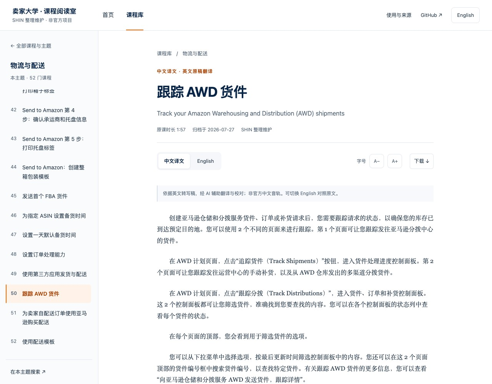
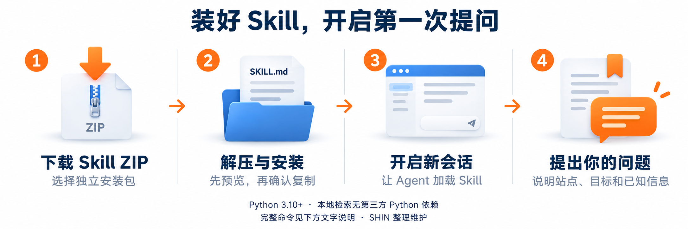
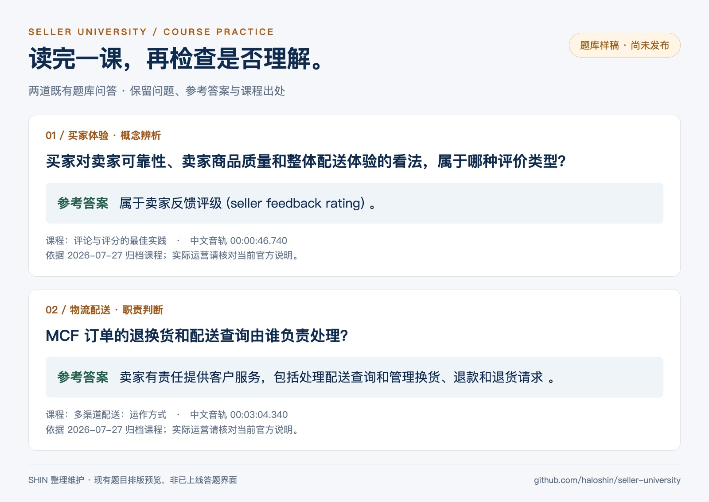

[← Seller University](../README.md) · **Amazon 专区 / Amazon collection**

<a name="亚马逊卖家大学--课程转写稿"></a>

<h1 align="center">亚马逊卖家大学</h1>

<p align="center"><strong>课程阅读库 + 卖家大学 Skill Beta</strong></p>

<p align="center">按原课顺序整理，方便阅读与查阅。</p>

<p align="center">
  <a href="https://haloshin.github.io/seller-university/"><strong>网页阅读 ↗</strong></a> &emsp;
  <a href="https://github.com/haloshin/seller-university/releases/latest"><strong>下载资料 ↓</strong></a> &emsp;
  <a href="https://github.com/haloshin/seller-university/releases/tag/skill-v1.0.0-beta.2"><strong>安装 Skill ↓</strong></a> &emsp;
  <a href="#接下来的更新"><strong>关注更新 →</strong></a>
</p>

<p align="center"><sub><a href="https://haloshin.github.io/seller-university/#view=library&ui=zh">全部课程</a> &nbsp; · &nbsp; <a href="学习导航.md">Markdown 导航</a> &nbsp; · &nbsp; <a href="README.en.md">English</a></sub></p>

<br>


<p align="center"><strong>270 门课程 &nbsp; / &nbsp; 455 份转写稿 &nbsp; / &nbsp; 8 个主题</strong><br><sub>英文 270 份 · 中文音轨稿 185 份 · 另附中文译文 85 份</sub></p>

<p align="center"><sub><a href="https://github.com/haloshin">SHIN</a> 整理维护 · 分享请保留来源与署名 · <a href="../NOTICE.md">使用条件</a></sub></p>

<br><br>

## 网页阅读与离线 HTML

**[打开完整阅读版 ↗](https://haloshin.github.io/seller-university/)** · [Markdown 学习导航](学习导航.md)

**270 门课程全部可中文阅读**：455 份原语言转写稿，另补 85 份中文译文。支持全文搜索、同主题课程目录、中英切换和字号调整。首页提供搜索与入门路径，课程库集中浏览和筛选，阅读页专注原文。电脑与手机均可使用。

下载完整 ZIP 并解压，双击根目录的 **`index.html`**，即可用浏览器离线阅读。请保留完整文件夹，无需安装软件或启动服务。

[](https://haloshin.github.io/seller-university/)

<sub>首页找方向 → 课程库选课 → 阅读原文。全文搜索也可离线使用。</sub>

<br><br>

## 按主题找课

[](https://haloshin.github.io/seller-university/#view=library&ui=zh)

从你正在处理的问题出发，进入对应课程。

<br>

| 从开店到发货 | 从获客到经营 |
| :--- | :--- |
| [入门与账户 · 12](https://haloshin.github.io/seller-university/#topic=start&ui=zh) | [广告与促销 · 54](https://haloshin.github.io/seller-university/#topic=ads&ui=zh) |
| [商品发布与定价 · 42](https://haloshin.github.io/seller-university/#topic=listings&ui=zh) | [品牌与买家体验 · 30](https://haloshin.github.io/seller-university/#topic=brands&ui=zh) |
| [物流与配送 · 52](https://haloshin.github.io/seller-university/#topic=fulfillment&ui=zh) | [全球开店 · 19](https://haloshin.github.io/seller-university/#topic=global&ui=zh) |
| [合规与账户健康 · 30](https://haloshin.github.io/seller-university/#topic=compliance&ui=zh) | [企业购与经营分析 · 31](https://haloshin.github.io/seller-university/#topic=business&ui=zh) |

<sub>主题与中文导航名由本项目编辑整理；课程页保留官方原标题。185 门提供中文音轨稿，其余 85 门提供中文译文，并保留英文原文。</sub>

<br><br>

## 第一次来，从这里读

<br>

1. **[新卖家 5 分钟开店概览](https://haloshin.github.io/seller-university/#view=course&id=eaf6dccf-18fd-49ee-9b08-988472334a0b&lang=zh_CN&ui=zh)** · [EN](https://haloshin.github.io/seller-university/#view=course&id=eaf6dccf-18fd-49ee-9b08-988472334a0b&lang=en_US&ui=zh)
2. **[卖家平台入门](https://haloshin.github.io/seller-university/#view=course&id=7656f83f-df7c-4a3f-93e6-84c7a1358cf9&lang=zh_CN&ui=zh)** · [EN](https://haloshin.github.io/seller-university/#view=course&id=7656f83f-df7c-4a3f-93e6-84c7a1358cf9&lang=en_US&ui=zh)
3. **[亚马逊销售政策概览](https://haloshin.github.io/seller-university/#view=course&id=84fea35b-c5c6-4ae3-999b-1cea1b3a6d96&lang=zh_CN&ui=zh)** · [EN](https://haloshin.github.io/seller-university/#view=course&id=84fea35b-c5c6-4ae3-999b-1cea1b3a6d96&lang=en_US&ui=zh)
4. **[商品发布入门](https://haloshin.github.io/seller-university/#view=course&id=a33f0b1d-5508-4db1-bd53-e24a3d9fb9b3&lang=zh_CN&ui=zh)** · [EN](https://haloshin.github.io/seller-university/#view=course&id=a33f0b1d-5508-4db1-bd53-e24a3d9fb9b3&lang=en_US&ui=zh)
5. **[亚马逊物流（FBA）入门](https://haloshin.github.io/seller-university/#view=course&id=472d8e74-3402-4871-88d2-0ebaeb3263eb&lang=zh_CN&ui=zh)** · [EN](https://haloshin.github.io/seller-university/#view=course&id=472d8e74-3402-4871-88d2-0ebaeb3263eb&lang=en_US&ui=zh)

<sub>自行配送订单？接着读 <a href="https://haloshin.github.io/seller-university/#view=course&amp;id=43f40d1f-0d52-4a7a-9c65-bb5be2ab5c01&amp;lang=zh_CN&amp;ui=zh">卖家自配送（FBM）入门</a>。</sub>

<br><br>

## 先看一段原文

FBA 入门课程的中文阅读页实拍。中文正文采用宋体等系统衬线字体，默认 16px、首行缩进两个汉字；段落之间留白，阅读列控制在 720px 以内。视频转写按讲解节奏整理为短段落，通常每段 1–3 句；阅读排版不另行改写已整理的转写文本。标题下可切换音轨、调整字号并下载原文；同主题课程目录保留在侧边。

[](https://haloshin.github.io/seller-university/#view=course&id=472d8e74-3402-4871-88d2-0ebaeb3263eb&lang=zh_CN&ui=zh)

<details>
<summary>展开查看英文阅读页</summary>

英文稿与中文稿分别来自对应音轨。

[](https://haloshin.github.io/seller-university/#view=course&id=472d8e74-3402-4871-88d2-0ebaeb3263eb&lang=en_US&ui=en)

</details>

<br>

**[继续读中文全文 ↗](https://haloshin.github.io/seller-university/#view=course&id=472d8e74-3402-4871-88d2-0ebaeb3263eb&lang=zh_CN&ui=zh)** &emsp; [Read in English](https://haloshin.github.io/seller-university/#view=course&id=472d8e74-3402-4871-88d2-0ebaeb3263eb&lang=en_US&ui=zh)

<br><br>

## 只有英文音轨的课，也能用中文读

85 门原先仅有英文稿的课程已补齐**中文译文**。参照现有中文音轨稿和术语库，尽量保留原课的步骤、案例、数字与适用条件；译文经 AI 辅助翻译与校对，页面单独标注来源。

[](https://haloshin.github.io/seller-university/#view=course&id=cd799532-62ff-4f7a-9853-fa83a5fc6dc1&lang=zh_CN_translation&ui=zh)

**[试读 AWD 中文译文 ↗](https://haloshin.github.io/seller-university/#view=course&id=cd799532-62ff-4f7a-9853-fa83a5fc6dc1&lang=zh_CN_translation&ui=zh)** · [查看全部中文译文](https://haloshin.github.io/seller-university/#view=library&language=zh_CN_translation&ui=zh)

<sub>译文提供 Markdown 与 TXT，纳入网页搜索和离线阅读。译文不代表官方中文音轨，也不附虚构的中文字幕；英文原文及原音轨 VTT 仍可获取。</sub>

<br><br>

## 带着问题，用卖家大学 Skill

**356 个 Amazon 知识模块 · 13 个能力包 · 全量 Beta 已发布。** 把课程用到具体问题里：找资料、解释概念、排查问题，也能结合你提供的信息整理 SOP。


### 可以怎么问？

| 你可以这样问 | Skill 会怎样帮你 |
| :--- | :--- |
| “Sessions 和 Page views 有什么区别？” | 解释概念，给出对应课程和阅读入口 |
| “这个商品为什么上架失败？” | 先了解站点和错误提示，再定位相关排查资料 |
| “FBA 库存积压，该清仓还是继续打广告？” | 先问库龄、库存和成本等必要信息，再整理方案，不凭空编数字 |
| “把这个流程整理成员工 SOP。” | 根据已提供事实，整理步骤、检查项和课程依据 |

其中 270 个模块连接中文课程阅读页，另 86 个暂无公开转写页。模块来源包含视频和文档，因此与阅读库的 270 门视频课程统计范围不同。Skill 不代操作店铺，也不把历史课程当作当前政策。

<br>

### 怎么安装？

**1. 一条命令安装**

电脑已安装 Node.js/npm 和 Git 后，在你使用 Agent 的项目文件夹里打开终端，运行：

```bash
npx skills add https://github.com/haloshin/seller-university --skill seller-university-skill
```

按安装器提示选择 Codex 或 Claude Code。也可以在命令后加 `--agent codex` 或 `--agent claude-code` 指定宿主。默认仅安装到当前项目；加 `-g` 则安装到用户目录，供其他项目使用。确认前检查安装位置与覆盖提示；已有同名 Skill 时先备份。这个第三方安装器可能替换旧版，与下方 ZIP 安装器的“不覆盖”机制不同。

Skill 的本地检索需要 **Python 3.10+**，不需要额外 Python 包或作者提供的 API Key。本次已验证 macOS 下 `skills 1.7.1` 的项目安装：安装文件与源码一致，安装后检索可用；这不等于宿主 UI 或 Windows 的完整实机验收。安装器选项见[官方说明](https://github.com/vercel-labs/skills#readme)。

<details>
<summary>不使用 npx，或想下载固定版本？展开 ZIP 安装说明</summary>



**1. [下载 Skill 安装包](https://github.com/haloshin/seller-university/releases/tag/skill-v1.0.0-beta.2)**，选择 `seller-university-skill-1.0.0-beta.2.zip` 并解压。它与 v0.9.2 课程阅读 ZIP 是两个独立下载包。

**2. 在解压得到的 `seller-university-skill` 文件夹内打开终端。** 需要 Python 3.10+，无需第三方 Python 包，也不依赖作者的服务器或 API Key。

```bash
# 先预览安装位置，不写入文件
python3 scripts/install.py --agent codex

# 确认目标位置后安装
python3 scripts/install.py --agent codex --apply
```

Claude Code 用户把 `codex` 换成 `claude`。已有同名 Skill 时安装器会停止，不自动覆盖；手动安装、自定义目录与回滚方式见[完整安装说明](../skills/seller-university-skill/README.md)。

</details>

**2. 在该项目中开启新的 Agent 会话，直接发送：**

```text
请使用 seller-university-skill。
解释 Sessions 和 Page views 的区别，
并给出对应课程的阅读链接和来源。
请区分历史课程内容与当前规则。
```

不想自己操作终端，也可以把[安装与启动说明](../skills/seller-university-skill/START-HERE.md)复制给你的 Agent。

<sub>当前为 Beta：已做隔离安装验证和 Agent 模拟；WorkBuddy、Windows 完整客户端流程尚未实测。知识卡图集和课程题库仍未发布。</sub>

<br><br>

## 接下来的更新

### 知识卡

一个主题，一组图。以「商品推广入门」为例，用封面和四张讲解卡，说明核心价值、展示位置、点击计费与每日预算。

[](../assets/knowledge-cards-preview.jpg)

<sub>预算卡按当前官方说明整理。<a href="docs/SOURCES.md#预算说明">查看课程与现行规则差异</a>。</sub>

<br>

### 课程题库

读完课程，用问答检查理解，结合参考答案回到原文复习。

[](../assets/question-bank-preview.jpg)

<sub>知识卡与题库正在整理，敬请期待。点击图片可放大查看。</sub>

<br><br>

## 下载与使用

下载后，即可离线阅读和检索。

<br>

**[下载完整 ZIP ↓](https://github.com/haloshin/seller-university/releases/latest)** &emsp; **[在线阅读 ↗](https://haloshin.github.io/seller-university/)**

<br>

### 下载包包含什么？

当前发布版 **v0.9.2** 包含：

- **270 门 Amazon 课程**：455 份原语言转写稿（270 英文＋185 中文音轨稿），另附 85 份中文译文。
- **HTML 离线阅读版**：课程导航、全文搜索、中英切换与字号调整。
- **Markdown、TXT 正文**，以及原音轨对应的 **455 份 VTT 字幕**；中文译文不附 VTT。
- **学习导航、课程目录、来源与使用说明**，以及 LICENSE、NOTICE 等随包文件。

不含视频文件；完整知识卡和课程题库尚未发布。Skill 提供[独立安装包](https://github.com/haloshin/seller-university/releases/tag/skill-v1.0.0-beta.2)，不包含在这个 v0.9.2 阅读 ZIP 中。

<br>

### Releases 页面该下载哪个？

**普通阅读请选择 `seller-university-v0.9.2.zip`。** 后续版本按同样的文件名格式选择阅读包。

| 下载项 | 包含什么 / 有什么用 |
| :--- | :--- |
| **`seller-university-v0.9.2.zip`** | 整理好的完整阅读包，解压后打开根目录的 `index.html` |
| `SHA256SUMS.txt` | 阅读包的 SHA-256 校验值，用于核对文件完整性 |
| `Source code (zip)` | GitHub 自动生成的该版本仓库快照，含课程资料、页面与脚本 |
| `Source code (tar.gz)` | 同一版本的仓库快照，压缩格式不同 |

<sub>仓库首页 README 和配图可能先于下一次发版更新；Release 下载包固定对应其标注版本，不会随仓库修改自动更新。以该版本发布说明与包内文件为准。</sub>

<br>

### 解压后，打开 index.html

双击根目录的 **`index.html`**，在浏览器中选课、搜索与离线阅读。也可继续使用 `amazon/学习导航.md`、Markdown 阅读器或 TXT 文本文件。

<br>


<br>

<details>
<summary><strong>文件格式、字幕与更多用法</strong></summary>

<br>

- **HTML** — `index.html`，完整浏览器阅读版，内含全部转写稿、目录与全文搜索；正文阅读无需联网，外部链接需联网。
- **Markdown** — `transcript.md`，在 GitHub 或 Markdown 阅读器中阅读全文。
- **TXT** — `transcript.txt`，用于全文检索、复制或导入阅读工具。
- **中文译文** — `amazon/translations/` 下的 `translation.md` 与 `translation.txt`，单独标注英文来源。
- **VTT** — `captions.vtt`，需支持外部字幕的播放器配合原视频使用；本包不含视频。

下载包附 [使用说明](../使用说明.txt)、[LICENSE](../LICENSE) 和 [NOTICE](../NOTICE.md)。TXT 与 VTT 保留纯课程文本，整理署名与使用条款在阅读页和随包说明中。

也可以克隆仓库：

```bash
git clone https://github.com/haloshin/seller-university.git
```

使用 AI 辅助学习时，提供选定课程全文及随附阅读说明，要求 AI 引用原文，并区分课程内容与自己的解释。

</details>

<br>

### 阅读时，顺着主题继续

<br>

**[打开 FBA 课程试读 ↗](https://haloshin.github.io/seller-university/#view=course&id=472d8e74-3402-4871-88d2-0ebaeb3263eb&lang=zh_CN&ui=zh)**

<sub>同主题阅读会延续所选语言。“中文音轨”和“中文译文”分别标明来源，可随时切回 English。</sub>

<br><br>

## 来源与反馈

### 保留来源，也保留整理者的署名

本项目由 **[SHIN](https://github.com/haloshin)** 独立整理，非 Amazon 官方发布或背书。分享请保留课程来源、整理署名和[原仓库链接](https://github.com/haloshin/seller-university)，勿冒充原创或官方发布。

课程内容及相关标识归原权利人所有。对 SHIN 依法享有著作权的原创编辑内容，超出许可的再发布或商用须另行许可；正常 Fork、法定使用权利和脚本 MIT 许可不受额外限制。[完整使用条件](../NOTICE.md) · [LICENSE](../LICENSE)

<br>

- **看原视频** — 在课程页点击“观看本课原视频”；260 门已匹配官方归档版本，7 门补充官方 YouTube 英文入口，其余 3 门补充官方相关英文视频，并明确标注版本待核验。详见[来源说明](docs/SOURCES.md)。
- **反馈错字或漏句** — [提交纠错](https://github.com/haloshin/seller-university/issues/new?template=correction.yml)，请附课程名、语言、时间位置和依据。

<sub>资料范围：2026-07-27 归档课程。“中文音轨”为原中文讲解转写；“中文译文”为英文稿的 AI 辅助翻译与校对，非官方中文音轨。少量课程附有简短阅读说明。费用、政策和界面请核对当前官方页面。<a href="docs/SOURCES.md">来源说明</a> · <a href="../CONTRIBUTING.md">贡献说明</a></sub>

<br>
